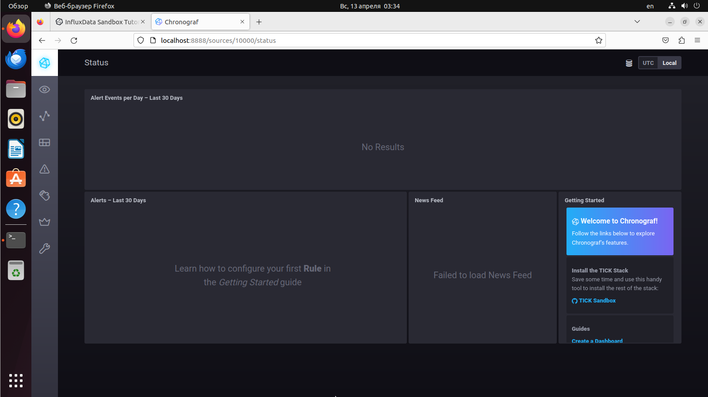
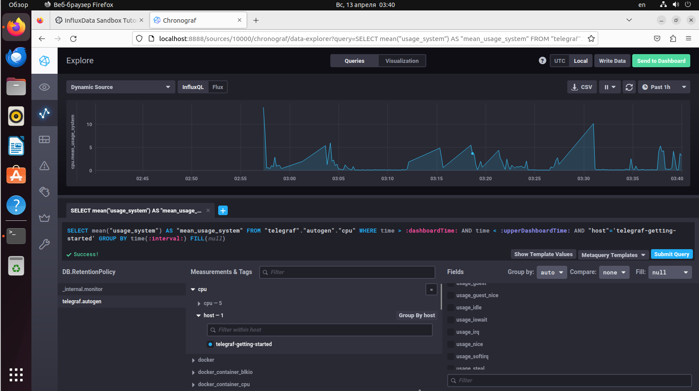
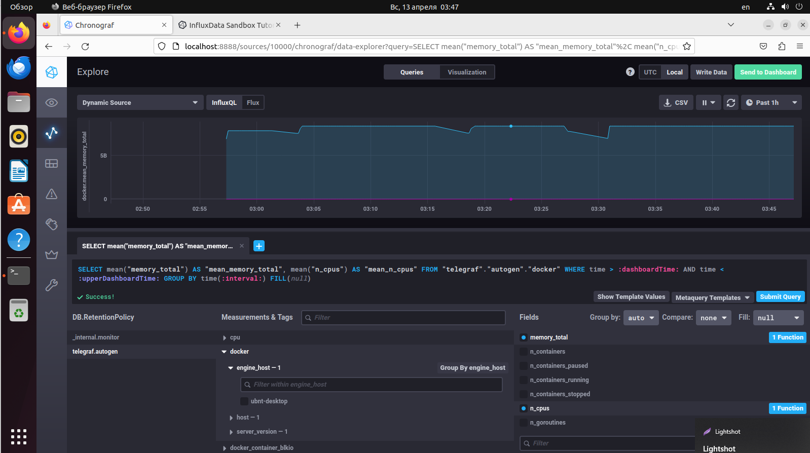

# Домашнее задание к занятию "13.Системы мониторинга"

## Обязательные задания

> 1. Вас пригласили настроить мониторинг на проект. На онбординге вам рассказали, что проект представляет из себя 
платформу для вычислений с выдачей текстовых отчетов, которые сохраняются на диск. Взаимодействие с платформой 
осуществляется по протоколу http. Также вам отметили, что вычисления загружают ЦПУ. Какой минимальный набор метрик вы
выведите в мониторинг и почему?

Скорость ответа по HTTP
Статус код HTTP ответа
Доступность HTTP порта

> 2. Менеджер продукта посмотрев на ваши метрики сказал, что ему непонятно что такое RAM/inodes/CPUla. Также он сказал, 
что хочет понимать, насколько мы выполняем свои обязанности перед клиентами и какое качество обслуживания. Что вы 
можете ему предложить?

Среднее значение скорости ответа по HTTP
SLA - процент соотноешния успешных запросов к общему их количеству

> 3. Вашей DevOps команде в этом году не выделили финансирование на построение системы сбора логов. Разработчики в свою 
очередь хотят видеть все ошибки, которые выдают их приложения. Какое решение вы можете предпринять в этой ситуации, 
чтобы разработчики получали ошибки приложения?

Установлю ftpd или samba и расшарю через них каталог с логами приложения на чтение

> 4. Вы, как опытный SRE, сделали мониторинг, куда вывели отображения выполнения SLA=99% по http кодам ответов. 
Вычисляете этот параметр по следующей формуле: summ_2xx_requests/summ_all_requests. Данный параметр не поднимается выше 
70%, но при этом в вашей системе нет кодов ответа 5xx и 4xx. Где у вас ошибка?

Возможно стоит более точно указать коды ошибок. В знаменателе 4хх+5хх ответы, а в числителе - 1хх+2хх+3хх

> 5. Опишите основные плюсы и минусы pull и push систем мониторинга.

Плюсы push-модели
- Real-time данные – метрики отправляются сразу, без задержек на опрос.
- Работает за NAT/Firewall – агенты инициируют соединение, не нужны публичные адреса для агентов
- Буферизация при проблемах – агенты могут копить данные и отправить позже.
Минусы push-модели
- Сложнее диагностировать недоступность агентов – если агент перестал слать данные, это не всегда значит, что он упал.
- Требует надежной доставки – если сервер недоступен, данные могут потеряться.

Плюсы pull-модели
- Гибкость в конфигурации – можно динамически менять частоту опроса и набор метрик.
- Проще детектировать недоступность – если сервер не может получить метрики, значит, сервис упал.
- Подходит для облачных и динамических сред – легко добавлять/удалять цели.
Минусы pull-модели
- Задержки в данных – метрики обновляются только при опросе (не подходит для real-time).
- Сложность с NAT/Firewall – сервер должен иметь доступ к агентам
- Односторонняя проверка – если сервер мониторинга недоступен, данные теряются.

> 6. Какие из ниже перечисленных систем относятся к push модели, а какие к pull? А может есть гибридные?

    - Prometheus - pull
    - TICK - pull
    - Zabbix - pull+push
    - VictoriaMetrics - pull+push
    - Nagios - pull+push


7. Склонируйте себе [репозиторий](https://github.com/influxdata/sandbox/tree/master) и запустите TICK-стэк, 
используя технологии docker и docker-compose.

В виде решения на это упражнение приведите скриншот веб-интерфейса ПО chronograf (`http://localhost:8888`). 

P.S.: если при запуске некоторые контейнеры будут падать с ошибкой - проставьте им режим `Z`, например
`./data:/var/lib:Z`



8. Перейдите в веб-интерфейс Chronograf (http://localhost:8888) и откройте вкладку Data explorer.
        
    - Нажмите на кнопку Add a query
    - Изучите вывод интерфейса и выберите БД telegraf.autogen
    - В `measurments` выберите cpu->host->telegraf-getting-started, а в `fields` выберите usage_system. Внизу появится график утилизации cpu.
    - Вверху вы можете увидеть запрос, аналогичный SQL-синтаксису. Поэкспериментируйте с запросом, попробуйте изменить группировку и интервал наблюдений.

Для выполнения задания приведите скриншот с отображением метрик утилизации cpu из веб-интерфейса.



9. Изучите список [telegraf inputs](https://github.com/influxdata/telegraf/tree/master/plugins/inputs). 
Добавьте в конфигурацию telegraf следующий плагин - [docker](https://github.com/influxdata/telegraf/tree/master/plugins/inputs/docker):
```
[[inputs.docker]]
  endpoint = "unix:///var/run/docker.sock"
```

Дополнительно вам может потребоваться донастройка контейнера telegraf в `docker-compose.yml` дополнительного volume и 
режима privileged:
```
  telegraf:
    image: telegraf:1.4.0
    privileged: true
    volumes:
      - ./etc/telegraf.conf:/etc/telegraf/telegraf.conf:Z
      - /var/run/docker.sock:/var/run/docker.sock:Z
    links:
      - influxdb
    ports:
      - "8092:8092/udp"
      - "8094:8094"
      - "8125:8125/udp"
```

После настройке перезапустите telegraf, обновите веб интерфейс и приведите скриншотом список `measurments` в 
веб-интерфейсе базы telegraf.autogen . Там должны появиться метрики, связанные с docker.

